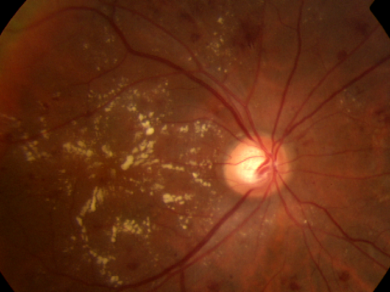
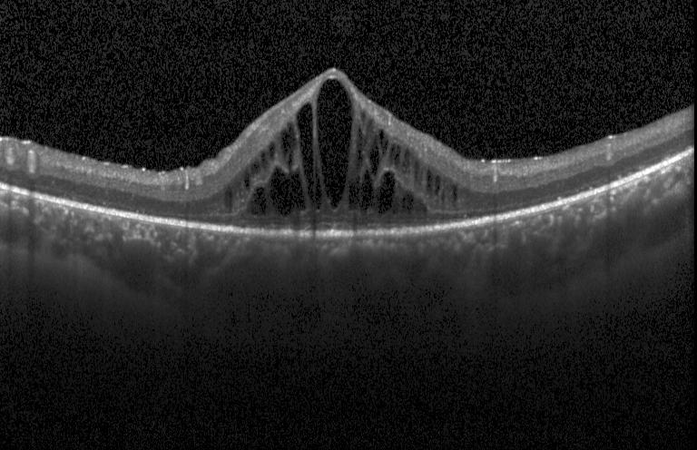

# Datasets

This project utilizes two publicly available retinal imaging datasets to develop and evaluate the **Bootstrap-Ensemble Multimodal Deep Learning Fusion Network (BEMDLFN)** for automated diabetic retinopathy (DR) detection.

The datasets are **not included** in this repository because of their large size and their respective licensing terms. Users should download the datasets from their official sources and organize them according to the directory structure shown below before running the notebook.

---

# Dataset Overview

| Dataset | Imaging Modality | Purpose |
|----------|------------------|---------|
| APTOS 2019 Blindness Detection | Color Fundus Photography | Structural retinal lesion analysis |
| Kermany2018 (OCT2017) | Optical Coherence Tomography (OCT) | Cross-sectional retinal feature extraction |

---

# 1. APTOS 2019 Blindness Detection

APTOS 2019 is a publicly available retinal fundus image dataset released as part of the Asia Pacific Tele-Ophthalmology Society Blindness Detection Challenge.

The dataset contains color retinal fundus photographs captured under varying illumination and imaging conditions. Each image is annotated with one of five diabetic retinopathy severity grades.

### Classes

- No DR
- Mild DR
- Moderate DR
- Severe DR
- Proliferative DR

### Official Download

https://www.kaggle.com/competitions/aptos2019-blindness-detection

---

# 2. Kermany2018 (OCT2017)

The Kermany2018 dataset consists of high-resolution Optical Coherence Tomography (OCT) scans collected from patients with different retinal conditions.

For this project, OCT images are used as a complementary imaging modality to provide additional retinal structural information alongside fundus photographs.

### Official Download

https://data.mendeley.com/datasets/rscbjbr9sj/2

---

# Sample Images

The following images illustrate the two retinal imaging modalities used in this work.

| Fundus Image (APTOS2019) | OCT Image (Kermany2018) |
|:------------------------:|:-----------------------:|
|  |  |

---

# Dataset Directory Structure

After downloading, organize the datasets as follows.

```text
datasets/
│
├── APTOS2019/
│   ├── train_images/
│   ├── test_images/
│   └── train.csv
│
└── OCT2017/
    ├── train/
    ├── validation/
    └── test/
```

---

# Usage

Place the downloaded datasets inside the `datasets` directory before executing the notebook.

If your local folder names or paths differ from those shown above, update the corresponding dataset paths in the notebook.

---

# Dataset Citation

If you use these datasets in your own research, please cite their original publications.

### APTOS 2019 Blindness Detection

APTOS 2019 Blindness Detection Challenge  
https://www.kaggle.com/competitions/aptos2019-blindness-detection

### Kermany2018

Kermany DS, Goldbaum M, Cai W, et al.

**Identifying Medical Diagnoses and Treatable Diseases by Image-Based Deep Learning.**

Cell, 2018.

---

# License

The datasets are distributed under their respective licenses.

This repository does **not** redistribute any dataset files.
Please obtain them directly from the official sources linked above.
